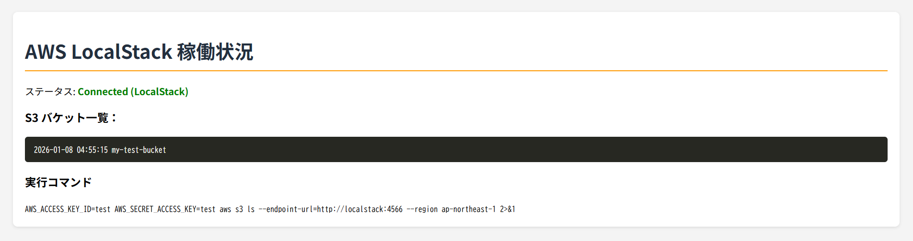
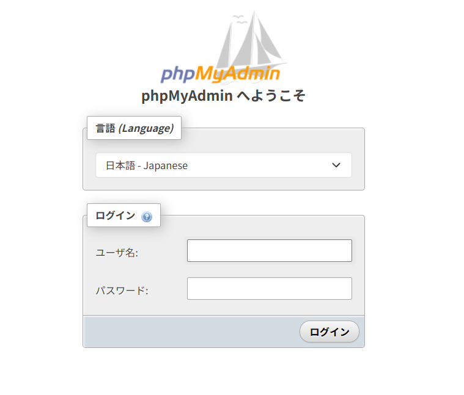
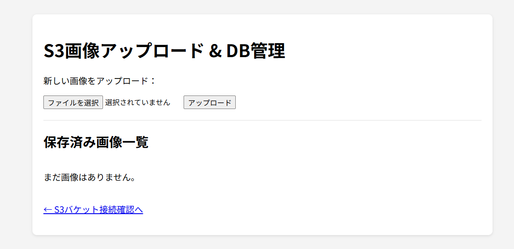

# localstack-test

## １．概要
dockerを使用してLAMP環境を構築する工程の学習用リポジトリです。Localstackで擬似的なAWS環境も同時に構築します。

## ２．動作環境
以下の環境での動作を確認済みです。
* **OS**: windows 11 (25H2)
* **Docker**: version 28.5.2
* **Docker Compose**: version 2.40.3
* **LocalStack**:docker-compose.ymlファイル内で最新バージョンを指定（latest）。

## ３．セットアップ手順
1) リポジトリをクローン
2) `.env`ファイルをルートディレクトリ内に作成(4.を参照)
3) docker composeでコンテナを一括起動<br>
    以下のコマンドをルートディレクトリで実行してください。

     ```bash
     docker compose up -d
     ```

4) 動作確認方法<br>
     ブラウザで以下のURLにアクセスしてください。<br>
     **phpMyAdmin**: http://localhost:8081/ <br>
     **LocalStack Health**: http://localhost:4566/_localstack/health/
     
## ４．環境変数の設定
プロジェクトのルートに`.env`ファイルを作成し、以下の内容を設定してください。

```text
# MySQL設定
DB_ROOT_PASSWORD=root 
DB_NAME=test_db  # 任意
DB_USER=test_user  # 任意
DB_PASSWORD=test_password  #任意のパスワードを設定
DB_TIMEZONE=Asia/Tokyo

#AWS（Localstack）設定
AWS_REGION=ap-northeast-1
AWS_ACCESS_KEY=test
AWS_SECRET_KEY=test 
```
## ５．使い方/サンプル
* コンテナ起動後、http://localhost/s3test.php/ にアクセスすると、S3バケットの作成状況が表示されます。

  

* phpMyAdminにアクセスすると、以下の画面が表示されます。サンプル通りの`.env`ファイルを作成した場合、
　「ユーザー名」="root"、「パスワード」="root"でログイン可能です。

<p align = center>
  
</p>

* http://localhost/upload.php/ にアクセスすると、画像をS3バケットに格納することができます。

<p align = center>
  
</p>

* http://localhost/upload.php/ では画像のアップロードに加え、保存済み画像の**削除**も可能です。
  * 「削除」ボタンを押すと、MySQLのレコードとLocalStack(S3)内の実体ファイルが同時に削除されます。

## ６．構成図


dockerを使用した構成のため、ホストOSに影響を与えずに仮想環境の構築が可能です。

## ７．よくある質問・トラブルシューティング
### S3バケットの実態確認をしたい。
ブラウザ上の表示だけでなく、`aws-cli`コンテナを使用して、CLI上でもLocalStack内の実体ファイルを確認可能です。その場合、以下のコマンドをターミナルで実行してください。

```text
# S3バケット内のファイル一覧を表示
docker exec -it aws-cli aws --endpoint-url=http://localstack:4566 s3 ls s3://my-test-bucket/uploads/
```
## ８．TODO/今後やりたいこと
* [x] S3への画像アップロードとDB登録
* [x] 保存済み画像の一覧表示
* [x] S3実体ファイルとDBレコードの同時削除機能
* [ ] DB操作のトランザクション管理（データ整合性の向上）

## ９．更新履歴
* **2026-01-26**: S3実態ファイルとMySQLレコードの同期削除機能を実装。
* **2026-01-26**: aws-cliコンテナからのS3動作確認手順を確立。
* **2026-01-14**: MySQLへのテーブル自動作成機能実装。
* **2026-01-14**: アップロードページの画像表示機能実装。
* **2026-01-13**: S3バケットへの画像データアップロード機能を実装。
* **2026-01-09**: PHPコンテナへのComposerのインストール機能追加。
* **2026-01-09**: リポジトリ作成。

## ライセンス
このプロジェクトは[MITライセンス](LICENSE)のもとで公開されています。